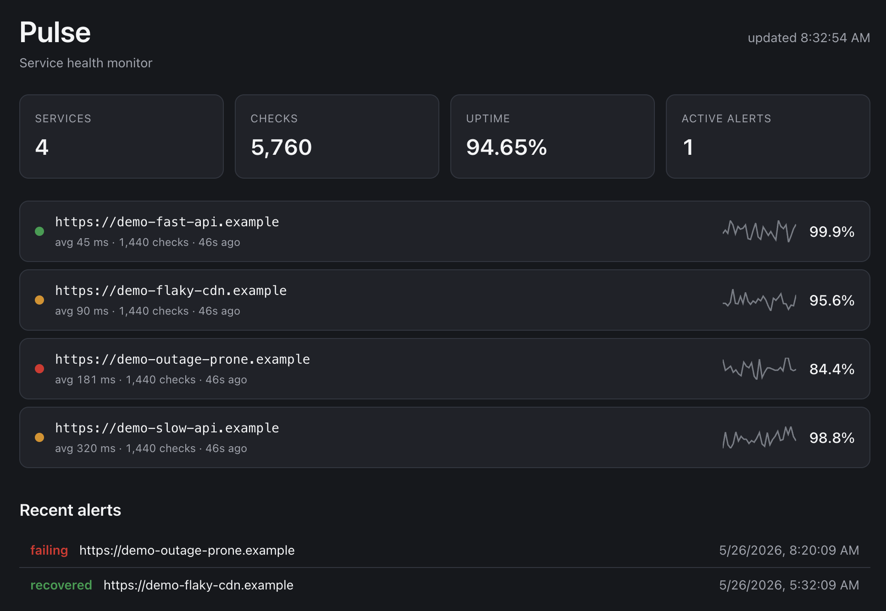
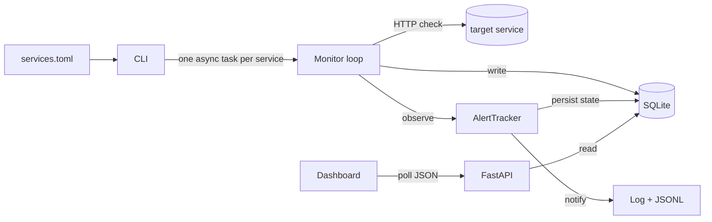

# Pulse

> Service health monitor. Async scheduled HTTP checks, uptime and latency tracking, REST API, web dashboard, and alerts.

<!-- After running `pulse demo`, screenshot the dashboard and save it at docs/dashboard.png. -->


## Run it in 30 seconds

```bash
git clone https://github.com/joey564-wq/pulse
cd pulse
uv sync
uv run pulse demo
# open http://localhost:8000
```

`pulse demo` seeds 24 hours of synthetic data and starts the dashboard. No network traffic — the four `demo-*` services are reproducible fake data (seed = 42).

To run against real services, see [Configuration](#configuration).

## What it does

- **Async HTTP checks** against configured services on per-service schedules.
- **Persistent storage** — every check (status, latency, error) is recorded to SQLite.
- **Per-service task isolation** — one failing service can't take down the others.
- **Graceful shutdown** — Ctrl-C cleanly stops all tasks, closes the HTTP client, disposes the engine.
- **Threshold alerting** with hysteresis — alerts fire after N consecutive failures and don't re-fire until recovery.
- **Alert state persists across restarts** — failure counters survive a `pulse monitor` restart, so monitoring is resilient to deploys.
- **Retention** via `pulse prune` (by age or by per-service record count).
- **Operational tooling** — `pulse stats` for a one-page snapshot, JSONL alert log, REST API for everything.
- **Self-contained dashboard** — vanilla HTML/CSS/JS, no frontend framework, dark mode, mobile-responsive.

## Architecture



**Stack.** Python 3.13, FastAPI, SQLAlchemy 2.0 ORM, Pydantic v2, httpx (async), Typer, Structlog. Tests with pytest, pytest-asyncio, pytest-httpx. Tooling via uv, mypy (strict on `src/`), ruff.

## CLI

| Command | Purpose |
|---|---|
| `pulse run` | One round of checks across all services |
| `pulse monitor` | Run continuously on per-service schedules; restart-safe |
| `pulse history [--url URL]` | Recent check records |
| `pulse stats` | One-page summary of monitoring history |
| `pulse prune --days N` | Retention by age |
| `pulse prune --keep-last N` | Retention by per-service record count |
| `pulse serve` | Start the API + dashboard server |
| `pulse demo` | Seed synthetic data and start the dashboard |

Run `pulse --help` or `pulse <command> --help` for options.

## REST API

| Method | Path | Description |
|---|---|---|
| GET | `/health` | Liveness check |
| GET | `/services` | All tracked service URLs |
| GET | `/history?url=U&limit=N` | Recent check records for one service |
| GET | `/summary` | Uptime + latency per service |
| GET | `/summary/{url:path}` | Single-service summary |
| GET | `/stats` | Overall counts and timeline |
| GET | `/alerts/recent?limit=N` | Recent alert events |
| GET | `/` | Dashboard (HTML) |

OpenAPI/Swagger docs auto-generated at `/docs`.

## Configuration

`services.toml`:

```toml
[[services]]
url = "https://example.com"
name = "example"           # optional, defaults to ""
interval_seconds = 30      # how often to check
timeout_seconds = 5
alert_after_failures = 3   # consecutive failures before firing
```

Then:

```bash
uv run pulse monitor --config services.toml --db pulse.db
```

Malformed `services.toml` produces a single human-readable error, not a Python traceback.

## Development

```bash
uv sync                          # install deps + create venv
uv run pytest                    # tests with coverage
uv run mypy                      # type check
uv run ruff check src tests      # lint
uv run ruff format src tests     # format
```

## Future extensions

The architecture is laid out so each of these is a defined extension, not a rewrite:

- Real notifier implementations behind the existing `Notifier` Protocol — Slack webhook, Discord, PagerDuty.
- Response-body matchers (`expected_substring`) per service for richer health checks than HTTP-status-only.
- Postgres support — SQLAlchemy 2.0 is already in place; the lift is the connection string.
- Per-service detail page with latency-over-time, percentile breakdowns, recent errors.
- Push-based metrics export (Prometheus `/metrics` endpoint).

**Out of scope (deliberately).** Clustering, horizontal scale, multi-tenant auth, distributed storage. v1.0 is the single-host, focused-feature-set release.